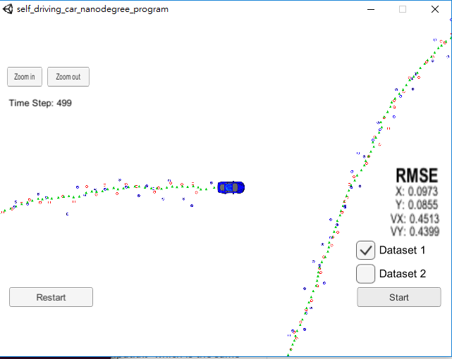
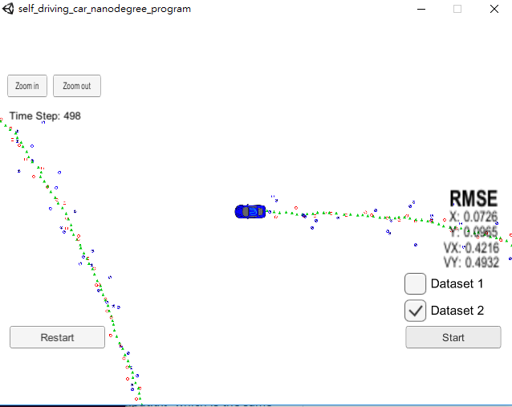

# Extended Kalman Filter Project Starter Code
Self-Driving Car Engineer Nanodegree Program

In this project, I utilized a Kalman filter to estimate  the state of a moving object of interest with noisy lidar and radar measurements. Passing the project requires obtaining RMSE values that are lower than the tolerance outlined in the project rubric which is  [.11, .11, 0.52, 0.52].

This project involves the Term 2 Simulator which can be downloaded [here](https://github.com/udacity/self-driving-car-sim/releases)

###Setup and build up environment

This repository includes two files that can be used to set up and install [uWebSocketIO](https://github.com/uWebSockets/uWebSockets) for either Linux or Mac systems. For windows you can use either Docker, VMware, or even [Windows 10 Bash on Ubuntu](https://www.howtogeek.com/249966/how-to-install-and-use-the-linux-bash-shell-on-windows-10/) to install uWebSocketIO. Please see [this concept in the classroom](https://classroom.udacity.com/nanodegrees/nd013/parts/40f38239-66b6-46ec-ae68-03afd8a601c8/modules/0949fca6-b379-42af-a919-ee50aa304e6a/lessons/f758c44c-5e40-4e01-93b5-1a82aa4e044f/concepts/16cf4a78-4fc7-49e1-8621-3450ca938b77) for the required version and installation scripts.

Once the install for uWebSocketIO is complete, the main program can be built and run by doing the following from the project top directory.

1. mkdir build
2. cd build
3. cmake ..
4. make
5. ./ExtendedKF

Tips for setting up your environment can be found [here](https://classroom.udacity.com/nanodegrees/nd013/parts/40f38239-66b6-46ec-ae68-03afd8a601c8/modules/0949fca6-b379-42af-a919-ee50aa304e6a/lessons/f758c44c-5e40-4e01-93b5-1a82aa4e044f/concepts/23d376c7-0195-4276-bdf0-e02f1f3c665d)

Note that the programs that need to be written to accomplish the project are src/FusionEKF.cpp, src/FusionEKF.h, kalman_filter.cpp, kalman_filter.h, tools.cpp, and tools.h

I maintain the program main.cpp which has already been filled out.

The program main.cpp has already been filled out, but feel free to modify it.

Here is the main protcol that main.cpp uses for uWebSocketIO in communicating with the simulator.

INPUT: values provided by the simulator to the c++ program

["sensor_measurement"] => the measurement that the simulator observed (either lidar or radar)

OUTPUT: values provided by the c++ program to the simulator

["estimate_x"] <= kalman filter estimated position x
["estimate_y"] <= kalman filter estimated position y
["rmse_x"]
["rmse_y"]
["rmse_vx"]
["rmse_vy"]

---

## Other Important Dependencies

* cmake >= 3.5
  * All OSes: [click here for installation instructions](https://cmake.org/install/)
* make >= 4.1 (Linux, Mac), 3.81 (Windows)
  * Linux: make is installed by default on most Linux distros
  * Mac: [install Xcode command line tools to get make](https://developer.apple.com/xcode/features/)
  * Windows: [Click here for installation instructions](http://gnuwin32.sourceforge.net/packages/make.htm)
* gcc/g++ >= 5.4
  * Linux: gcc / g++ is installed by default on most Linux distros
  * Mac: same deal as make - [install Xcode command line tools](https://developer.apple.com/xcode/features/)
  * Windows: recommend using [MinGW](http://www.mingw.org/)

## Code Style

I used Asytle package to maintain the coding style:

-  [Google's C++ style guide](https://google.github.io/styleguide/cppguide.html).

- indent using spaces
- set tab width to 2 spaces (keeps the matrices in source code aligned)

## project rubric

- [x] Compiling

- Code must compile without errors with `cmake` and `make`.  In the "build" directory, you can compiler it to get "ExtendedKF"

- [x] Accuracy

  - [x] px, py, vx, vy output coordinates must have an RMSE <= [.11, .11, 0.52, 0.52] 

    both RMSE of Dataset 1 and Dataset 2 meet this criteria.

    

  - 

    ​

- [x] Follows the Correct Algorithm
  - [x] Sensor Fusion algorithm follows the general processing flow as taught in the preceding lessons.

      According to the lessons of the extended kalman-filter, there are 

      - FusionEKF.cpp/.h, which is extended kalman filter to fusion lidar and rasar sensor, 
      - kalman_filter.cpp/.h which is the kalman filter functions with  predict and update processes.
      - tools.cpp/.h includes calculation RMSE  function and calculation Jacobian function.

  - [x] Kalman Filter algorithm handles the first measurements appropriately.

      The process of the first measurements could be found in FusionEKF.cpp line 79 to 138.

      The first state position x, y and velocity x, y :[px, py, vx, vy] are initialized according to different sensor type.

  - [x] Kalman Filter algorithm first predicts then updates.

      The processes of predicts and updates could be found in FusionEKF.cpp line 140 to 211.

  - [x] Kalman Filter can handle radar and lidar measurements.

      In FusionEKF.cpp from line 167 to 211, there are define selection. I just tested kalman filter with only radar sensor, only lidar sensor, or both radar and lidar sensors to measurement.  

      The test results are in result/vid directory.

      Use both lidar and radar sensor to measurement can get the perfect result, which RMSE is about [0.09,0.08,0.45,0.43]

      Use only lidar sensor to measurement get not so perfect but can be acceptable result, which RMSE is about [0.14,0.11,0.63,0.52]

      Use only radar sensor to measurement get bad result, which RMSE is about [11.18,8.14,9.17,6.9]

